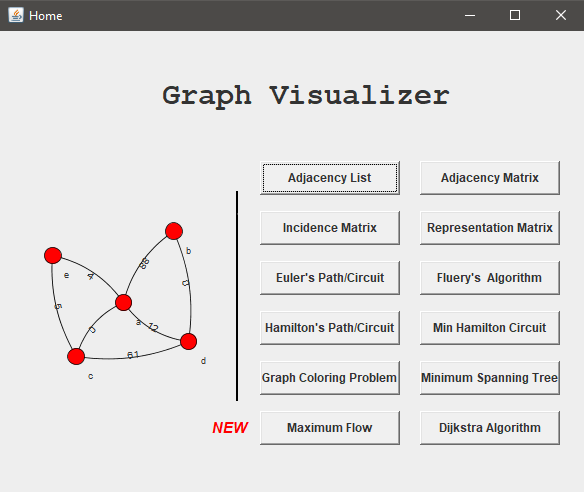
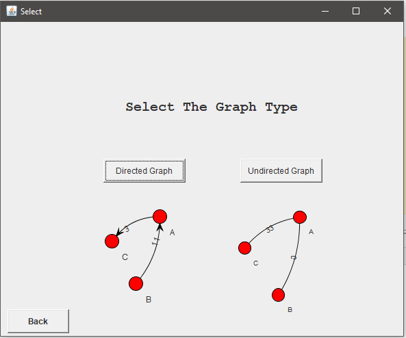
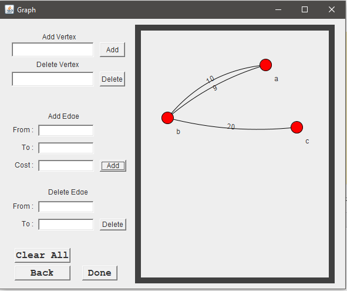
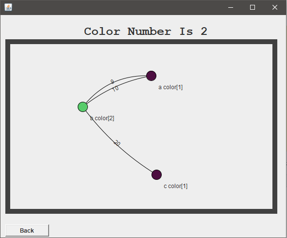

## Graph Visualizer

is a Java Program to apply some algorithms on a visualized graph
  - Simple Graph
    - Directed
    - Undirected
  - Multigraph
    - Directed
    - Undirected

## Installation

 - Minimum Java SE Runtime Environment : 5.0 
 
## Algorithms

   <table>
  <tr>
    <td> Adjacency List </td>
    <td> Adjacency Matrix</td>
  </tr>
  <tr>
    <td> Incidence Matrix </td>
    <td> Representation Matrix </td>
  </tr>
  <tr>
    <td> Minimum Spanning Tree</td>
    <td> Hamiltonian Algorithm</td>
  </tr>
  <tr>
    <td> Euler Algorithm</td>
    <td> Fluery Algorithm</td>
  </tr>
  <tr>
    <td> Minimum Hamiltonian Cycles </td>
    <td> Coloring Problem </td>
  </tr>
  </table>
 

  
## Visuals

 <table align="center">
  <tr>
    <td>  </td>
    <td>  </td>
  </tr>
  <tr>
    <td>   </td>
    <td>   </td>
  </tr>
  </table>
